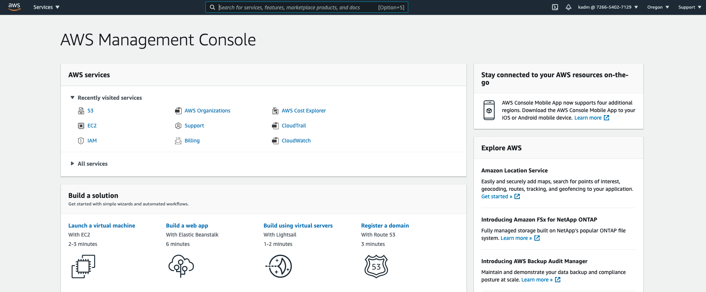
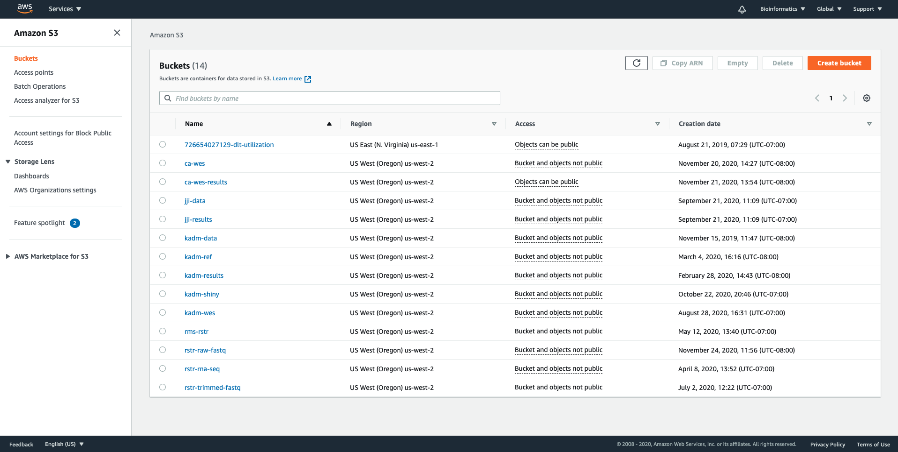
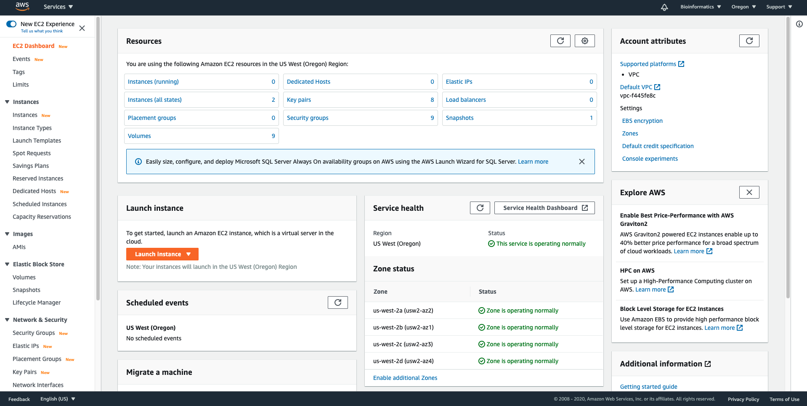
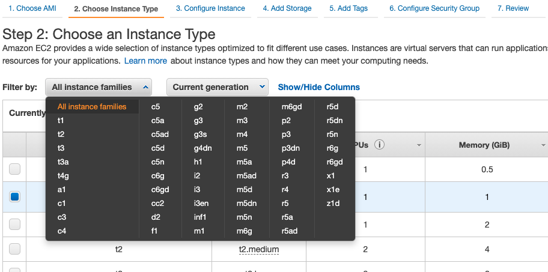
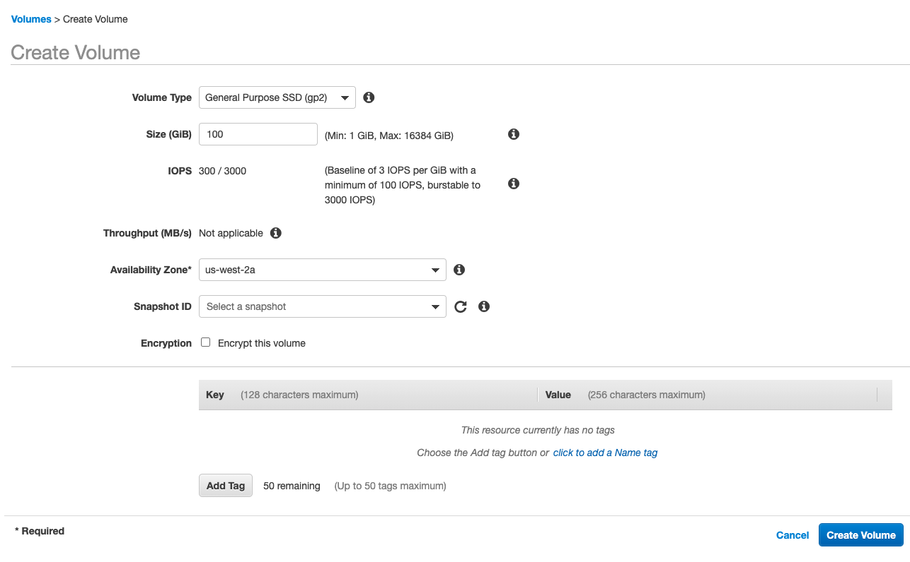
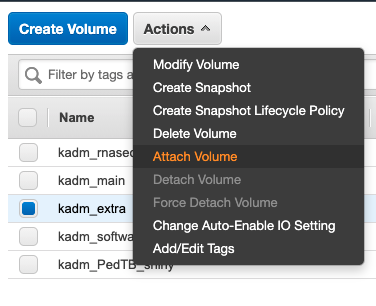
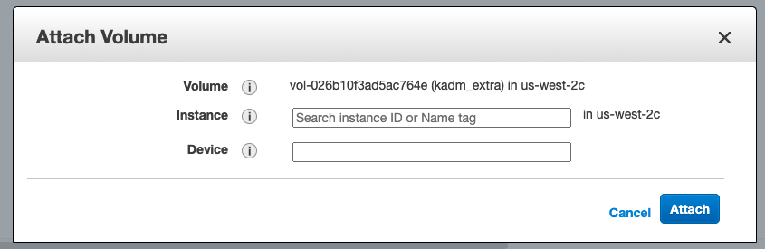
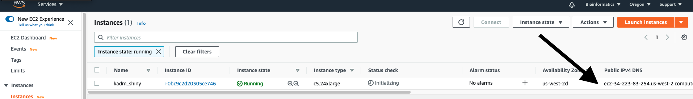
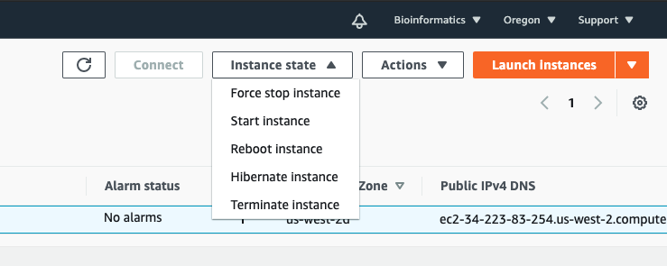

# Do you need AWS?

Amazon Web Services (AWS) and other cloud computing resources provide two main advantages over running code on your local computer. First, you can access much larger, faster computers that allow you to complete your analyses in a fraction of the time it would take on the average personal computer. Second, you can run these resources remotely, thus connecting from anywhere and allowing processes to continue to run even when your personal computer is off or tied up doing other things.

So when considering if you want to use AWS, we suggest considering the following.

1. Computational power
    - How big are your input and output files? How much RAM will you need? You certainly don't need exact numbers here but instead, consider your needs broadly. Chances are that if you're running something on your computer that takes more than an hour to complete, the cloud will be your friend.
2. Time and effort
    - How familiar are you with command line? If you are new to coding, think about how much time you'll need to dedicate to learning the tool and weigh that against how much time you'll save running things. Also, keep in mind how often you want to do this task. If it's a short task that you need to complete, say, every month, the time savings will add up!
3. Software
    - What tools will you need? Do they have command line versions? If not, setting up on the cloud will be more difficult (but still possible).
4. Cost
    - This is last because cloud computing is now so inexpensive! However, it's not free. As you'll see below, you can estimate the cost of completing something on AWS and consider that against how quickly you need results, etc.

This is in no way meant to dissuade you from learning to use cloud resources! However, we want to avoid frustrations that end in abandonment and thinking "I should have just done this in Excel..."

# EC2 vs. S3

The two AWS resources you will likely use are Elastic Compute Cloud (EC2) and Simple Cloud Storage Service (S3). Think of EC2 as RAM and processors, or where you run programs. Think of S3 as the hard drive, or where you store files. While some files can be stored on EC2, it is more expensive and not as stable. Thus, it is best to only have what you're currently working on in that space.

# Setup AWS
## Create an account

Go to AWS account setup at <https://portal.aws.amazon.com/billing/signup#/start> and create an account. Please note that AWS does talk to regular Amazon so if you have an Amazon account, best to use a different email here. Your **UW email** is preferred.

Next, send your account admin (probably Kim <kadm@uw.edu>) an email with the email address you've used for your account. They will add you to the AWS organization and send you 1) an access key ID, 2) a secret access key, and 3) a log-in link in a `.csv`. **SAVE** this file as you'll need these keys to access AWS.

Finally, link your individual account to the organization by logging in as an IAM user with the console log-in link in the `.csv` from Kim (or input the account ID in that link at <https://console.aws.amazon.com/>). 

## Navigating AWS online

Log-in to your IAM account at <https://console.aws.amazon.com>. 

{width=75%}

Under 'All services', you will find EC2 resources under 'Compute' and S3 under 'Storage' (though soon they will be much easier to find under 'Recently visited services' at the top as in the above example). As mentioned earlier, these are the two major arms of AWS that you will likely use.

## Download AWS CLI

AWS has its own Command Line Interface (CLI) which gets around any differences between AWS resources and your personal computer (*e.g.* operating system, versions, etc.). Download the CLI at <https://aws.amazon.com/cli/> (links on right). Once complete, check that it installed correctly by going to your command line (called Terminal on Mac/Linux) and typing `aws` [Enter]. You should see some information on aws commands and an error (because we didn't provide a full command) as below. Windows may look slightly different.

```{bash eval=FALSE}
aws
usage: aws [options] <command> <subcommand> [<subcommand> ...] [parameters]
To see help text, you can run:

  aws help
  aws <command> help
  aws <command> <subcommand> help
aws: error: the following arguments are required: command
```

## Setup account in CLI

Next, you need to link your account to the CLI on your computer using the keys that your account admin sent you. Do so with `aws configure` and input your values as below. You'll need to do this once on every computer you access AWS through.

```{bash eval=FALSE}
aws configure
AWS Access Key ID [None]: #################
AWS Secret Access Key [None]: #################
Default region name [None]: us-west-2
Default output format [None]: txt
```

Now you're ready to use AWS!

# Tutorial

The following will take you through a simple example using AWS. This includes:

1. Uploading files to S3 (called a bucket)
2. Creating a EC2 cloud computer (called an instance)
3. Linking your S3 bucket to your EC2 instance
4. Using additional EBS storage
5. Downloading files from EC2 directly or through S3

## Upload to S3

In your word processor of choice, create a text (`.txt`) file on your Desktop named `test.txt`. You can write whatever you want in there! Next, upload this file to S3 using the online tool or through the CLI as described below.

#### Online tool

Go to AWS S3 at <https://s3.console.aws.amazon.com/s3/>. 

{width=75%}

Create a bucket (which is basically a folder) with the orange button in the upper right. You want to keep the default settings especially 'Block all public access' in order to adhere to HIPAA. Note that the bucket name must be unique across all of S3 so things like 'data' won't work. For those in the Hawn organization, please start all your bucket names with your initials.

You can then interact with the bucket just like the file explorer on your computer. Click 'Upload' or drag and drop your file to upload it to S3.

#### CLI

Alternatively, the AWS CLI has built in commands for interacting with both S3 and EC2. To make a bucket, you use `aws s3 mb` like so. 

```{bash eval=FALSE}
aws s3 mb s3://kadm-test
```

Then you can copy to S3 using `aws s3 cp` with the standard command line setup of [where the file is] followed by [where you want it to go]. Since you've already provided your access keys with `aws configure`, you shouldn't need to log-in again.

```{bash eval=FALSE}
aws s3 cp ~/Desktop/test.txt s3://kadm-test
```

Or copy an entire directory using `aws s3 sync`. This is helpful if you have many files as it only copies or updates files that are different between the two locations. *Do not run this as it will copy everythin on your desktop to S3.*

```{bash eval=FALSE}
aws s3 sync ~/Desktop/ s3://kadm-test
```

## Making an EC2 instance

Returning to your AWS account homepage, go to the EC2 resources at <https://us-west-2.console.aws.amazon.com/ec2/>. 

{width=75%}

There are a lot of options here but all we really care about is in the left panel under 'Instance > Instances' and 'Elastic Block Storage > Volumes'. The instance is the basic computer you setup in the cloud and the EBS volumes are additional hard drive space you can add to that basic computer. 

First, go to Instances and 'Launch Instance'. Then, build your desired computer. When setting up to run a real job, you'll need to choose the operating system, size, and security that best fit your needs. Here, we will make the most basic one possible with

1. Amazon Linux 2 AMI 
2. t2.micro
    - Compare costs for different base machines at <https://aws.amazon.com/emr/pricing/>.
    - You can view classes of machines with the filters. Names starting with "c" are compute-optimized (more processors, less RAM) and "m" are memory-optimized (fewer processors, more RAM). "r" have even higher RAM to processors ratios. Larger numbers indicate more processors and RAM, thus more cost.

{width=50%}    
    
3. Keep all defaults until Step 4: Add Storage. Here, you can change the size of your EC2 instance as well as add additional storage volumes (EBS). 
4. Add a 1GB additional volume and leave the defaults for the base one. Select the 'Delete on Termination' option for all volumes.
    - In general, it is best to build an EC2 instance that has enough space on its main storage volume for all the programs you will need. Then attach additional EBS volume(s) big enough for all your intermediate and outputs files. For example, we usually make the main one 32 GB and additional EBS 1 TB.
    - EBS is not recommended for *long term* file storage because it is more expensive than S3 and is not saved when you terminate an instance.
5. Next, progress to Step 6: Security
4. Add a rule for "HTTPS". Rename the security group "basic" (as this is one you'll want to use again and again).
5. Continue and launch.
    - Don't worry about the warning to improve security. We're not doing anything that needs additional protection.
6. The browser will then pop-up a key pair box. While you already have a key to access the organization, the EC2 instance also needs a key. This is so you can restrict access to your work within the organization. 
    - A key can be used multiple times and for multiple EC2 instances. I recommend you create a new key for each project. This way you can share it within a project group without compromising other projects.
7. Name the key pair something and download it.
8. Finally, launch the instance. The instance will take a minute or two to start up. 
9. Under 'Instance > Instances, name the instance you just made. Hawn organization members, please include your initials in the name.

### Adding additional EBS storage

You may wish to add additional storage to your EC2 instance either because you forgot in Step 4 above or because you find that you need more later on. 

If you go to 'Elastic Block Storage > Volumes', you will see the storage that we created with the EC2 instance we just built. To make more, click "Create Volume" and make a volume of your desired size. Be sure to select the 'Availability zone' (us-west-2a/b/c/d) that matches the EC2 instance you want to use. 

{width=75%}

Then select the new volume and link it to your EC2 instance under 'Actions > Attach volume'. If you did not pick the correct zone, you will not see your instance as an option and will need to delete this one and make a new one. There are also options to detach, delete, etc volumes under the 'Actions' menu.

{width=25%} {width=50%}

## Log-in to EC2

You access your EC2 instance from the AWS CLI using the key file you downloaded. Depending on your operating system, this key may not be accessible by the CLI so we will need to change its permissions. In your terminal, navigate to wherever the key `.pem` file is and change its permissions to 600. For example, I keep all my keys in one folder here.

```{bash eval=FALSE}
cd ~/AWS/keys/

chmod 600 test.pem
```

Next log-in to your instance with secure shell `ssh` using the key file and your instance's public IPv4 DNS (found under 'INSTANCE > Instances'). It will be something similar to below. 

{width=75%}

```{bash eval=FALSE}
ssh -i ~/Documents/AWS/keys/test.pem ec2-user@ec2-54-185-232-33.us-west-2.compute.amazonaws.com
```

Note that different operating systems on EC2 have different default user names. The Amazon AMI uses `ec2-user@` while Ubuntu Linux ones use `ubuntu@`.

If you get a question about 'The authenticity of host ... can't be established' type `yes` [Enter] to allow the connection. 

You can now explore your cloud computer in the command just like you would your own. At this point, though, there is nothing to see in the home directory.

```{bash eval=FALSE}
pwd
/home/ec2-user

ls

```

## Update and download software on EC2

Note that this is all specific to the Amazon AMI, which uses `yum` functions. If you are using a Linux EC2 instance, replace with `apt-get`.

### Basic updates

Each EC2 operating system comes with some pre-installed software. Always begin by updating all software currently on the EC2.

```{bash eval=FALSE}
sudo yum upgrade -y
sudo yum update -y
```

### Install AWS CLI

The Amazon AMI comes with the AWS CLI but if you choose an AMI without it, you can install it like so.

```{bash eval=FALSE}
sudo yum install awscli -y
```

### Install other software

You can install pretty much any program compatible with the OS in one way or another. There are a number of pre-packaged AWS programs than can be installed with 

```{bash eval=FALSE}
sudo amazon-linux-extras install PROGRAM_NAME
```

Please see the conda and R tutorials for specific download instructions. Or simply Google for command line instructions to install your software of choice. 

## Fuse S3 to EC2

As we've mentioned, S3 is the best place to put your data. You can directly access data on S3 without copying it to EC2 by linking these accounts. This saves *a lot* of time! Plus, data fused from S3 *do not* count against your EC2/EBS storage. Thus, you could have a 100 GB EBS volume with a directory fused to a 1 TB S3 bucket.

First, configure your AWS CLI on the cloud computer just as you did on your own computer.

```{bash eval=FALSE}
aws configure

AWS Access Key ID [None]: #################
AWS Secret Access Key [None]: #################
Default region name [None]: us-west-2
Default output format [None]: txt
```

Then install fuse and all its dependencies.

```{bash eval=FALSE}
sudo amazon-linux-extras install -y epel
sudo yum install -y s3fs-fuse
```

Create a key for fuse which is your `UserKey:SecretKey` in a file named `.passwd-s3fs`. Similar to your other key file, change the permissions to 600.

```{bash eval=FALSE}
echo #################:################# > ~/.passwd-s3fs

chmod 600  ~/.passwd-s3fs
```

Mount your S3 bucket to this instance. A bucket can be fused to multiple directories on multiple instances but the directory on the instance can only be fused to one bucket at a time. Here, we make a `data` directory in the home directory and link our test bucket to it.

```{bash eval=FALSE}
mkdir data/

s3fs kadm-test ~/data -o passwd_file=~/.passwd-s3fs \
    -o default_acl=public-read -o uid=1000 -o gid=1000 -o umask=0007
```

*Note the `\` in the above code. This allows you to write multiple lines in the terminal. You could also input the above all on one line without the `\`.*

If for some reason you need to unmount this bucket, use the following.

```{bash eval=FALSE}
fusermount -u ~/data/kadm-test
```

### A note on permissions

S3 bucket permissions can be a bit tricky. To avoid most of these issues, I recommend you create separate directories for 1) original data, 2) intermediate data, 3) final data. 

As we did above, the original data is fused from S3 to your EC2 in `data/`. However, if you try to write a new file to this directory, you will get a permissions error; it becomes "read-only" once fused. So, as you work on the instance, save all outputs to a second directory like `working/`. Finally, copy any files you want to download to a third directory like `results/` and download this to a *different* S3 bucket (more on this below).

## Using EBS

Earlier we added a 1 GB elastic block storage (EBS) volume to our EC2. You can see all the volumes associated with your instance with `lsblk`. 

Below only highlights the disks; you can ignore the part types (short for partition). You'll see that the main disk (nvme0n1) is mounted to the root directory `/` while the additional EBS volume (nvme1n1) has no mount point. The names that you see may be different based on the OS you chose but you should be able to identify the EBS volume based on its size. 

```{bash eval=FALSE}
lsblk

NAME        MAJ:MIN RM SIZE RO TYPE MOUNTPOINT
nvme1n1     259:0    0   1G  0 disk 
nvme0n1     259:1    0   8G  0 disk /
```

Any added EBS volumes are completely unformatted. So, we need to name and format the volume before using it. First, make the volume into a filesystem with `sudo mkfs`. Note that adding `sudo` to any command makes it run as an administrator on your account.

```{bash eval=FALSE}
sudo mkfs -t ext4 /dev/nvme1n1
```

Then, make a directory and mount it to the EBS volume. You will also need to change the permissions on the directory to 777 so you can read and write to it.

```{bash eval=FALSE}
sudo mkdir ~/results
sudo mount /dev/nvme1n1 ~/results
sudo chmod 777 -R ~/results
```

Listing the volumes again, you will see that the EBS one is now mounted to the `results/` directory.

```{bash eval=FALSE}
lsblk

NAME        MAJ:MIN RM SIZE RO TYPE MOUNTPOINT
nvme1n1     259:0    0   1G  0 disk /home/ec2-user/results
nvme0n1     259:1    0   8G  0 disk /
```

You can now use this additional storage just like it is part of the original EC2 machine. For example, copy and rename the `test.txt` file into your results directory with

```{bash eval=FALSE}
cp ~/data/test.txt ~/results/test2.txt
```

And you will see it there in addition to an automatically made 'lost+found' which is basically a trash folder.

```{bash eval=FALSE}
ls results/
lost+found  test2.txt
```

#### A note on where to download programs

If you need to download additional software, you have the option to either put it on the main EC2 or on an EBS volume. There are pros and cons to each. Using the main EC2 means that every time you turn off the instance, your programs are deleted. This prevents you from cluttering the machine and being charged for storage, but forces you to re-download and install next time you start it up again. On the other hand, programs on an EBS volume are only deleted if you delete that volume. Thus, you can re-use the same set of programs on any of your EC2 instances without re-downloading. But be careful of cost as the EBS storage accrues charges even when you have no instances currently running.

## Download from EC2
### To your computer

Similar to putting your data up on S3, you can copy it down from the EC2. This is easiest if you are NOT logged into your AWS EC2 because we know the EC2 server address (we used it to log-in) but not our home computer server address.

Thus, exit your instance in the terminal with `exit` (or open another command line window) and secure copy `scp` a file you want with the standard command line setup of [where the file is] followed by [where you want it to go]. 

```{bash eval=FALSE}
scp -i ~/Documents/AWS/keys/genomics.pem \
ec2-user@ec2-54-185-232-33.us-west-2.compute.amazonaws.com:~/results/test2.txt ~/Desktop/
```

Or copy an entire directory with `aws s3 sync`. *Again do not run the whole desktop sync.*

```{bash eval=FALSE}
aws s3 sync ec2-user@ec2-54-185-232-33.us-west-2.compute.amazonaws.com:~/results/ \ 
~/Desktop/
```

### Through S3

You may also want to download your files through S3. This is helpful in that your files are then backed up on S3 and easily transferable back to EC2 if you find you need to do more analyses.

First, log back into your EC2 instance if you logged out in the previous section. Then, create a bucket for your results.

```{bash eval=FALSE}
aws s3 mb s3://kadm-results
```

Then sync your results directory to S3. This will copy everything to S3, where you can download it from the online tool or CLI similar to how we uploaded the `test.txt` file earlier.

```{bash eval=FALSE}
aws s3 sync ~/results/ s3://kadm-results
```

## Shutting down EC2

Both EC2 and S3 are charged per time of use. So when not in use, you need to turn off your EC2 instance. To turn off EC2, go to the EC2 resources at <https://us-west-2.console.aws.amazon.com/ec2/>. Select your instance and under Actions > Instance State, either

1. "Stop" the instance to turn it off or
2. "Terminate" the instance to completely delete it

{width=50%}

Either option pops up a warning about losing data. This refers to anything on the original EC2 build NOT to your EBS volumes. In either case, the instance is now off and you are not being charged for it.

However, you are still being charged for any EBS volumes not deleted upon termination so you also need to go to the EBS volumes tab, select your volume, and either

1. "Detach Volume" to separate it from any EC2 instances (still accrues charges)
2. "Delete Volume" to completely delete it (no longer accrues charges)

Thus, unless you will be using the same programs or data very soon, it is best to save whatever is on your EBS volumes to S3 and delete the volume at this point.

Also, not shown here, you should clean out your S3 data to only those files you need.

# Hawn policies

These policies are specific to the Hawn organization.

### Access keys and passwords

* IAM log-in passwords should be changed at least once a year. Kim will periodically send out reminders.
* Access keys will be changed every ~6 months. Kim will send out new keys as needed and confirm deactivation of old keys beforehand. This means you will need to update `aws configure`.

### Naming

* All of your EC2 instances, EBS volumes, and S3 buckets should be named starting with your initials.
* All long term backup data should be named `PI-project-type` like `hawn-rstr-rnaseq`. You may remove the project label if data span multiple projects such as `hawn-megaex`

### Resource clean-up

* Everyone is responsible for their AWS resources. Please do not modify or delete anyone's buckets, instances, etc
* However, unused resources may be deleted *especially if they are unnamed*. Kim will do her best to confer with everyone but may unilaterally terminate and delete things if they are unclaimed.

### Longterm backup

* All projects should be backed-up to AWS S3. Each backup must contain
    - Raw data (fastq, idat, PLINK, etc)
    - Final data (usually data frames)
    - Any scripts needed to reproducibly get from raw to final data
    - Text file detailing software versions used in scripts
* To conserve space, all data should be compressed (zip, gz, Rdata, etc)
* Once approved by Kim, these buckets are moved to S3 Glacier storage. This form of storage is not meant for active use and must be restored to regular S3 before being used in additional analyses. This can take up to 12 hrs so please plan accordingly.

***