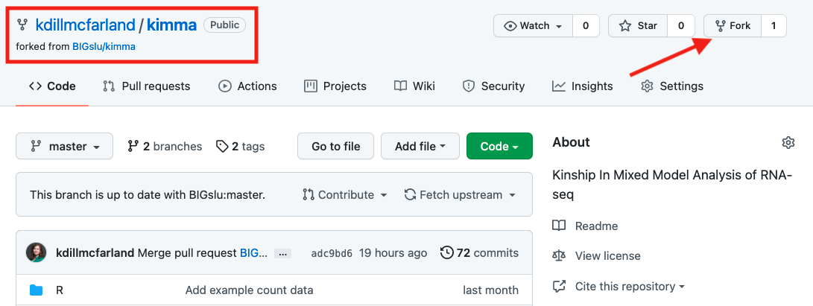

# Overview

This document takes you through contributing to one of BIGslu's R packages on GitHub. In the process, you will be introduced to GitHub issues, branches, forks, and pull requests. This tutorial assumes a working knowledge of git and GitHub similar to what is covered in our [GitHub tutorial](link). (coming soon)

# 1. GitHub issues

An issue is a note posted to a GitHub repo letting the owner know that there is a problem or need within that repo. They can relate to anything, and owners often use color-coded tags to group similar types of issues. For example, in the `kimma` package repository, there are a number of open issues. A common type is a `bug` which details an error or warning with something in the repo. There are also requests for new functions or features (`enhancement`) and for new or edits of help pages, vignettes, etc (`documentation`). Tags can be customized by the repo owner so you will see others across GitHub.

## 1.1: Create an issue

If you notice something wrong in a repo or have an idea for a change/addition, you can make a new issue with the green button in the upper right. In BIGslu, you can then choose a template that best describes the issue you'd like to create. If none of the templates apply, you can create a blank issue to fill out using the link at the bottom.

## 1.2: Create an issue list

Sometimes you'll have multiple errors or ideas for a repo. In this case, you can create one issue with the entire list of ideas by selecting "Open a blank issue" and using the checklist `- [ ]` markdown formatting. Then, when someone wants to address one, they can quickly convert it to its own separate issue by hovering over the list and selecting the blue circle for that line.

## 1.3: Have an issue conversation

Once an issue it posted, it has its own page where others can ask questions or continue to build on the idea. Often there will be a lot of back-and-forth in this conversation before anyone is ready to make changes to the code as we clarify what is being asked and debate the best ways to accomplish it. Posting issues and contributing to open issue conversations is a great way to help BIGslu without writing any code!

In this tutorial, we will tackle the following issue on a fit warning in `kimma::kmFit( )`. This example uses our "feature request" template and contains a little bit of conversation between myself and a colleague.

# 2. GitHub branches and forks

If you're not the owner of a repo, you can't simply make changes and push them to GitHub. And even if you are the owner, it's best to separate your experimental changes from the main version that others are using. To do this, we create a separate branch to house changes. This branch is later merged with the main branch to create a harmonious single version for everyone.

## 2.1: Create a branch (owner)

I prefer to work in a GitHub GUI, though these steps can also be accomplished in the command line. In GitHub Desktop, I create a new branch like so.

Every branch must have it's own unique name. I generally name the branch where I work on GitHub issues `dev` for development. This branch can be used to address multiple issues in the future so don't feel like you need to name it anything specific to the issue you're currently addressing. 

Creating the branch will automatically move you into that branch in the GUI. You can move between branches under this menu.

## 2.2: Create a fork (non-owner)

The above works because I have write privileges to the repo. You will likely not have these privileges so you will need to create a fork instead by using the Fork button in the upper right on the original repo page. A GitHub fork is a copy of the repo (like a branch) but it is housed in your account instead of the original account. In the red box below, notice that this fork of `kimma` is in my account (kdillmcfarland) but still linked to the original repo under BIGslu. 

## 2.3: Working within a branch/fork

Whether you are in a branch or a fork, you can now make changes to the repo without impacting the main branch that everyone else uses. Here, I've made a number of changes in my branch to accomplish the goals in the GitHub issue. I've also added and commited these changes to the `dev` branch with git.

Now looking at the branch on GitHub, we can see a message that the branch is 5 commits ahead of the main (also called master) branch. This means my changes are only available on the `dev` branch.

You may spend a couple hours to even months working on a branch/fork! Whenever you've completed and tested your changes, it's time to merge it with the main so everyone can benefit from your work.

# 3. GitHub pull request

A pull request asks the owner of the repo to review your branch/fork and merge those changes with the main. Like an issue, this opens up a conversation where collaboration can take place.

## 3.1: Create a pull request

In the last screenshot, you'll see a Compare & pull request button. Since GitHub noticed that the `dev` branch is ahead of the main, it automatically points you to the next step. You can also create a request under the Pull requests tab at the top. Make sure that the to <- from branches in grey are correct for merging your branch with the main. If you're working in a fork, select the blue compare across forks link first.

Once you've initiated the request, you will see our template where you should provide an informative title and purpose. Later, we will link this request to the GitHub issue, so you don't need to write exhaustive notes here. You can leave the tests unchecked or pre-mark those you've completed with an `x`.

Once submitted, the pull request contains the form, summary of commits on the `dev` branch, and an auto-merge check. This check let's us know if there are any conflicts with simply merging the `dev` changes with the main branch as is. Here, we have no conflicts since the main branch has not changed since I started `dev`. Resolving merge conflicts is outside the scope of this tutorial.

## 3.2: Link to original issue

On the right-side, select Linked issues and select the appropriate the appropriate issue for this request. This keeps things tidy and will automatically close the issue once the request is completed!

{width=30%}

## 3.3: Code review

Prior to merging your pull request, another member of BIGslu must review it. GitHub has a lot of features to facilitate this collaboration. The main request page is a conversation space like the original issue. You can also go to the Commits or Files change tabs to see the line-by-line changes made to the code. This space also has conversational features seen when you hover over the code and select the blue +.

Once complete, the reviewer will either initiate the merge or (more likely) provide comments for you to address. These are summarized on the main request page.

{width=60%}

## 3.4: Merge pull request with main

Once everyone is happy with the edits, the repo owner will merge the pull request. This places all the `dev` changes to the main branch.

{width=60%}

Because they are linked, this also closes the associated issue.

{width=60%} 

See the full pull request history at <https://github.com/BIGslu/kimma/pull/10>

# 4. Cleaning up

If you don't plan to make regular contributions to a repo, it's best to delete your `dev` branch or fork. This keeps things from getting cluttered. However, if you're a regular contributor, you can use the branch/fork again for future issues. See the live workshop where I use this same branch to tackle another `kimma` issue. <https://youtu.be/-u-3Zar2Hew>

***
