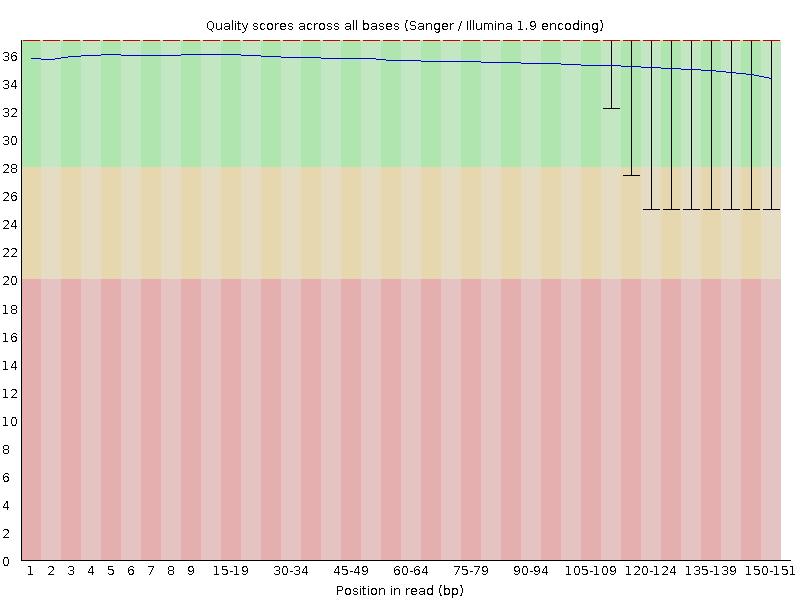
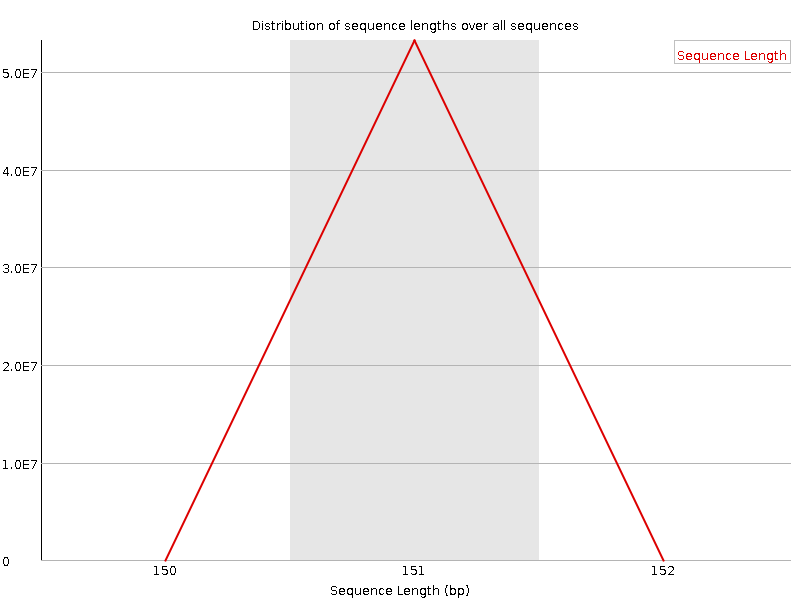
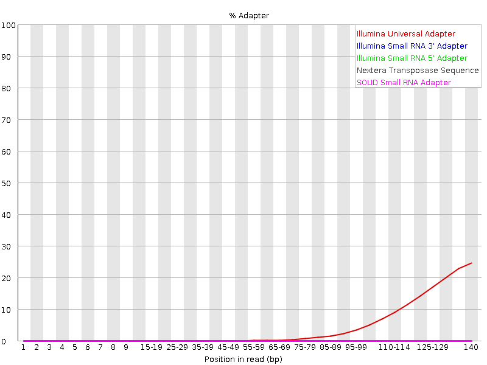
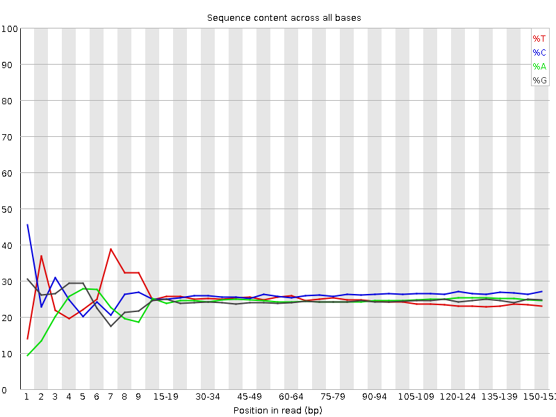
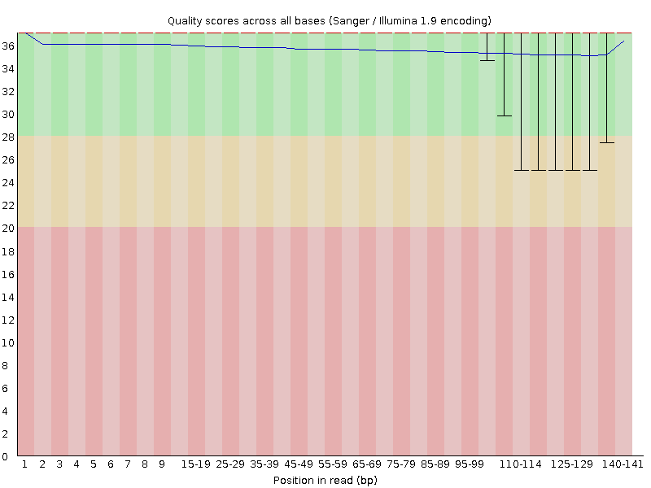
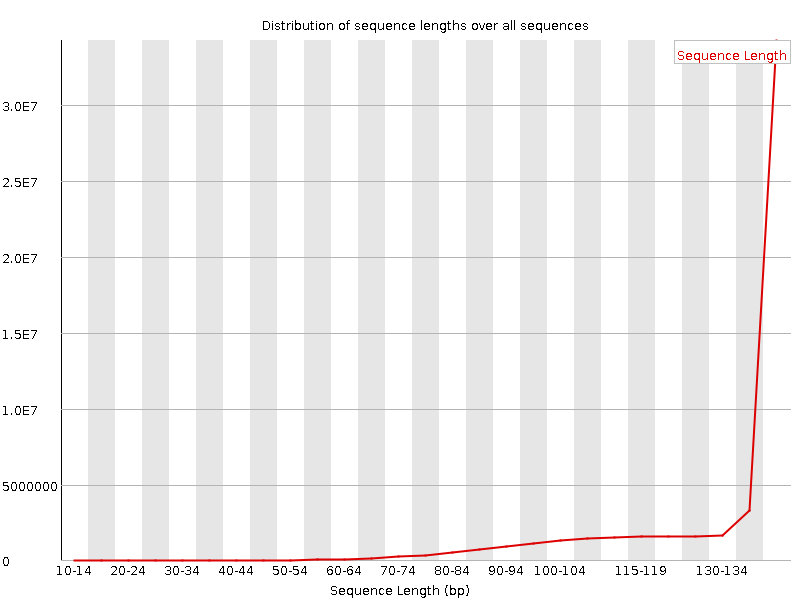
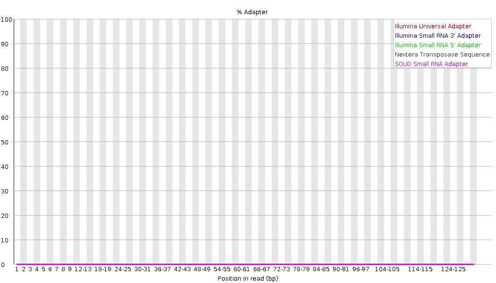
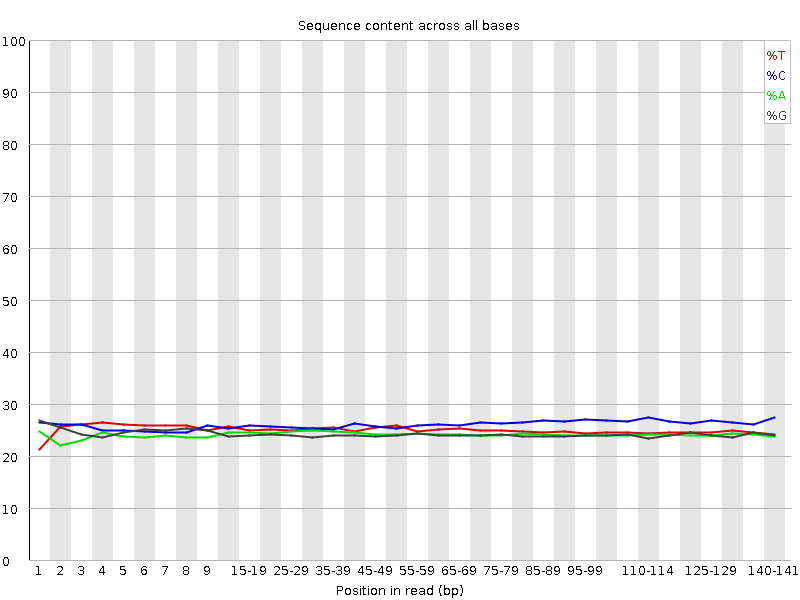

```{r include=FALSE}
knitr::opts_chunk$set(eval=FALSE)
```

# Overview

This document covers the Hawn lab recommended data cleaning pipeline for RNA-seq fastq files. Specifically, it is for human, bulk, paired-end RNA-seq. Modification is needed for use with other organisms or single-read libraries; this pipeline cannot be applied to single cell data. This pipeline includes quality assessment and filtering, alignment, and count table generation. The detailed sections contain example code using a single example library. A full pipeline to process multiple libraries is available at the end.

# 0. Setup
## Software

We process RNAseq libraries on a Linux server through AWS. This document is meant as an overview and bash code chunks herein should not be run in R. To achieve our AWS setup, please follow the AWS tutorials to [setup an account][aws_tut] and [install conda software][conda_tut]. Alternatively, you can install the following software individually on the system you are using.

* [FastQC][FastQC]
* [AdapterRemoval][AdapterRemoval]
* [samtools][samtools]
* [bedtools][bedtools]
* [Picard][Picard] (optional)
* [STAR][STAR]
* [Subread][Subread]
* [S3 fuse][S3 fuse] (if using AWS stored data)

## Directory structure
Files will be organized as follows.

```{r eval=TRUE, echo=FALSE, message=FALSE}
#You do not need to run this. See HTML or PDF document for figure.
library(DiagrammeR)
grViz(diagram = "digraph flowchart {
  node [fontname = arial, shape = retangle, fontsize=8, height=0.1]
  dir1 [label = '@@1']
  dir2 [label = '@@2']
  dir3 [label = '@@3']
  dir4 [label = '@@4']
  dir5 [label = '@@5']
  dir6 [label = '@@6']
  dir7 [label = '@@7']
  dir8 [label = '@@8']
  dir9 [label = '@@9']

  dir1 -> dir2;
  dir1 -> dir3 -> dir4,dir5,dir6,dir7,dir8;
  dir1 -> dir9;
  }
  
  [1]: '/'
  [2]: 'data/'
  [3]: 'results/'
  [4]: 'fastqc/'
  [5]: 'fastq_trim/'
  [6]: 'bam/'
  [7]: 'metrics/'
  [8]: 'counts/'
  [9]: 'ref/'
  ")
```

You can achieve this structure will the following.

```{bash}

mkdir -p data/
mkdir -p results/fastqc
mkdir -p results/fastq_trim
mkdir -p results/bam
mkdir -p results/metrics
mkdir -p results/counts
mkdir -p ref/

#set permissions
sudo chmod 777 -R results/
sudo chmod 777 -R ref/

```

The `data/` directory should contain all `.fastq`/`.fastq.gz` files for analysis and is likely fused to an S3 bucket. For reference, fusing can be completed with the following. See the [AWS setup tutorial][aws_tut] for more details.

```{bash}

# Key file for fuse. Fill in your access keys
echo #################:################# > ~/.passwd-s3fs
chmod 600  ~/.passwd-s3fs

# Fuse bucket to data/
s3fs bucket-name data -o passwd_file=~/.passwd-s3fs \
    -o default_acl=public-read -o uid=1000 -o gid=1000 -o umask=0007
    
```

## Example library
This tutorial contains example outputs from one library in the Hawn MDM interferon stimulation RNAseq data set (Sept 2021). To run your file, please input the file and sample names here. Or use the script at the end to run all files in your `data/` directory.

If you have the ability to run on multiple threads, please also set this value to your total threads minus 2. 

```{bash}

read1="6634-TH-1_S1_L005_R1_001.fastq.gz"
read2="6634-TH-1_S1_L005_R2_001.fastq.gz"
basename="6634-TH-1"

threads=1

```

# 1. Sequence quality assessment

We assess sequence quality using [FastQC][FastQC] for each read. Results are saved in `results/fastqc/` and include an `html` report with the following figures.

```{bash}

fastqc data/$read1 -o results/fastqc/ -t $threads

fastqc data/$read2 -o results/fastqc/ -t $threads

```

#### Example

Overall, read 1 quality is high with Phred scores > 30 (left) and sequence lengths centered at the maximum for this run (right). The drop off in quality toward the 3' ends is common as sequencing error increases with sequence length.

{width=49%} {width=49%}

There appear to be adapters present in these sequences. Here, FastQC identified the Illumina universal adapters toward the ends of sequences (left). This occurs when your biological sequence is shorter than the read length, and the sequencer goes beyond it into the adapter attaching DNA to the flow cell.

Not all adapters are identified by FastQC, so you can also check for them based on the sequence content (right). Adapters result in low diversity of per base content (*e.g.* percent of reads with each of ACTG at each position). This is seen here at the start of the sequences where the first 10 bp are disproportionately one or two base types.

Note that we do not see low diversity at the ends where we identified the universal adapters. This is because only up to ~25% of sequences have these adapters with the rest containing long enough amplicons to be entirely real data. Thus, per base content is not as impacted as it is with (likely) 100% of sequences having adapters at the start.
 
{width=49%} {width=49%}

# 2. Adapter removal and quality filtering
Adapters are trimmed and sequences are quality filtered using [AdapterRemoval][AdapterRemoval]. Trimmed files are saved in `results/fastq_trim`.

In these data, we have both 5' and 3' adapter contamination. Thus, quality filtering includes:

* `--trim5p` trim the 5' end by N base pairs to remove adapters. This value should be equal to where the per base sequence content levels out around 25% for all base types.
* `--adapter1 --adapter2` trim bp that align to known adapter sequences.
* `--maxns` remove sequences with > N ambiguous base
* `--trimqualities --minquality` trim ends until reach base with quality > N
* `--minlength` remove reads < N bp in length

```{bash}

AdapterRemoval --file1 data/$read1 --file2 data/$read2 \
    --basename results/fastq_trim/$basename --gzip \
    --trim5p 10 --maxns 1 --minlength 15 \
    --trimqualities --minquality 30 \
    --adapter1 AGATCGGAAGAGCACACGTCTGAACTCCAGTCAC \
    --adapter2 AGATCGGAAGAGCGTCGTGTAGGGAAAGAGTGT \
    --threads $threads
    
```

### Alternate adapter filtering
The above code will work for most Hawn data sets. However, you may need to make some modifications.

* If your barcodes are a different length, modify the number of bp trimmed with `--trim5p`. 
* If you do not have barcode contamination, remove the `--trim5p` option.
* If you do not have adapter contamination, the original code will work but you can improve speed by removing the `--adapter1 --adapter2` options.
* If you have different adapters, modify the sequences after `--adapter1 --adapter2`. You can determine adapter sequences for several common library preparations [here][adapters] or by using

  ```{bash}
  AdapterRemoval --identify-adapters --file1 $read1 --file2 $read2 --threads $threads
  ```

### Re-assess quality
Next, we assess trimmed sequence quality using [FastQC][FastQC] again. Results are saved in `results/fastqc/`.

```{bash}

fastqc results/fastq_trim/$basename.pair1.truncated.gz -o results/fastqc/ -t $threads
    
fastqc results/fastq_trim/$basename.pair2.truncated.gz -o results/fastqc/ -t $threads

```

#### Example
Read 1 sequence quality is improved and adapters are no longer present in the data.

{width=49%} {width=49%}  
{width=49%}  {width=49%}

# 3. Alignment to reference genome
Using [STAR][STAR], we align sequence data to the [GRCh38][GRCh38] reference human genome. Results are saved in `results/bam/`.

### Format reference genome
Look for the latest genome release at <https://ftp.ensembl.org/pub/> and set the release number here.

```{bash}

number="104"

```

Then, download the reference genome and create an alignment index.

```{bash tidy=TRUE, tidy.opts=list(width.cutoff=100)}

#Set file structure
mkdir -p ref/release"$number"/STARref
sudo chmod 777 -R ref/

#Download reference
source_url="ftp://ftp.ensembl.org/pub/release-$number"

sudo curl -O --output-dir ref/release"$number"/STARref \
    $source_url/gtf/homo_sapiens/Homo_sapiens.GRCh38.$number.gtf.gz
    
sudo curl -O --output-dir ref/release"$number"/STARref \
    $source_url/fasta/homo_sapiens/dna/Homo_sapiens.GRCh38.dna.primary_assembly.fa.gz

gunzip ref/release"$number"/STARref/*

#Index genome
STAR --runMode genomeGenerate \
     --genomeDir ref/release$number/STARindex \
     --genomeFastaFiles \
        ref/release$number/STARref/Homo_sapiens.GRCh38.dna.primary_assembly.fa \
     --sjdbGTFfile ref/release$number/STARref/Homo_sapiens.GRCh38.$number.gtf \
     --sjdbOverhang 99 \
     --runThreadN $threads

```

#### Hawn lab members:
Check the S3 bucket `human-ref` for the latest release. If it is present, simply fuse this bucket to your `ref/` directory.

```{bash}

s3fs human-ref ref -o passwd_file=~/.passwd-s3fs \
    -o default_acl=public-read -o uid=1000 -o gid=1000 -o umask=0007
    
```

### Align sequences
Now we align sequences to the reference index and save the alignment in a compressed BAM file sorted by genome position.

```{bash}

STAR --genomeDir ref/release$number/STARindex \
         --readFilesIn results/fastq_trim/$basename.pair1.truncated.gz \
                       results/fastq_trim/$basename.pair2.truncated.gz \
         --readFilesCommand zcat \
         --outFileNamePrefix results/bam/"$basename"_ \
         --outSAMtype BAM SortedByCoordinate \
         --runThreadN $threads \
         --runRNGseed 8756
         
```

# 4. Alignment quality assessment and filtering
Alignments are filtered with [samtools][samtools] `view` with the following flags. Results are saved in `results/bam/`. If you require different filtering, Broad has a nice [tool][Btool] for determining flag values.

* `-h` keep header
* `-f 3` keep paired reads where both mapped
* `-F 1284` remove unmapped reads, non-primary alignments, and PCR duplicates
* `-q 30` remove alignments with MAPQ < 30

```{bash}

samtools view results/bam/"$basename"_Aligned.sortedByCoord.out.bam \
      -h -f 3 -F 1284 -q 30 -@ $threads \
      -o results/bam/"$basename"_filter.bam

```

Then, we assess alignment quality before and after filtering with [samtools][samtools] `flagstat`. Results are saved in `results/metrics/`.

```{bash}

samtools flagstat results/bam/"$basename"_Aligned.sortedByCoord.out.bam \
    -@ $threads > results/metrics/"$basename"_Aligned_flagstat.tsv

samtools flagstat results/bam/"$basename"_filter.bam \
    -@ $threads > results/metrics/"$basename"_filter_flagstat.tsv
    
```

#### Example
`flagstat` results are formatted as total reads passing QC + total reads failing QC. Since we filtered separately with `view` and did not input any QC into `flagstat`, all our failed values should be 0, and we need only look at the first values.

Here, we see that `r 61871001-56417334` sequences were removed during alignment filtering (1). These were mainly secondary alignments (2), unpaired reads (3 compared to totals in 1), and PCR duplicates (4). After filtering, read 1 contains about 56 million reads

Ref | Aligned | Aligned, filtered | Flag
--- | ------- | ----------------- | ----
1   | 61871001 + 0 | 56417334 + 0 | in total (QC-passed reads + QC-failed reads)
2   | 3052746 + 0 | 0 + 0 | secondary
.   | 0 + 0 | 0 + 0 | supplementary
.   | 0 + 0 | 0 + 0 | duplicates
.   | 61871001 + 0 | 56417334 + 0 | mapped (100.00% : N/A)
.   | 58818255 + 0 | 56417334 + 0 | paired in sequencing
.   | 29409871 + 0 | 28208667 + 0 | read1
.   | 29408384 + 0 | 28208667 + 0 | read2
3   | 58816556 + 0 | 56417334 + 0 | properly paired (100.00% : N/A)
3   | 58816556 + 0 | 56417334 + 0 | with itself and mate mapped
4   | 1699 + 0 | 0 + 0 | singletons (0.00% : N/A)
.   | 0 + 0 | 0 + 0 | with mate mapped to a different chr
.   | 0 + 0 | 0 + 0 | with mate mapped to a different chr (mapQ>=5)

### Optional alignment assessment
[Picard][Picard] is another tool useful for assessing alignment quality. [Picard metrics][Pmetric] include median coefficient of variation (CV) of coverage, alignment percentage, etc. While these metrics are useful, this program is very slow and cannot run on multiple threads. Thus, you may wish to skip this assessment for large data sets.

Download Picard reference. **Hawn lab members**, this reference is already in your `ref/` directory if you previously fused to the `human-ref` bucket.

```{bash}

#Set file structure
mkdir -p ref/PICARDref
sudo chmod 777 -R ref/

#Download reference
sudo curl -O --output-dir ref/PICARDref \
    http://hgdownload.cse.ucsc.edu/goldenPath/hg38/database/refFlat.txt.gz
    
gunzip ref/PICARDref/refFlat.txt.gz

## Remove "chr" in chromosome name to match ensembl alignment using in STAR
sed 's/chr//' ref/PICARDref/refFlat.txt > ref/PICARDref/refFlat.ensembl.txt

```

Then, run Picard `CollectRnaSeqMetrics`. 

*Note: Your Picard executable will have a different file path if you did not install with conda. Also, please update to the latest Picard version as necessary.*

```{bash}

java -jar ~/apps/anaconda/share/picard-2.26.2-0/picard.jar \
        CollectRnaSeqMetrics \
        REF_FLAT=ref/PICARDref/refFlat.ensembl.txt \
        INPUT=results/bam/"$basename"_Aligned.sortedByCoord.out.bam  \
        OUTPUT=results/metrics/"$basename"_Aligned_picard.tsv \
        ASSUME_SORTED=true STRAND_SPECIFICITY=NONE MINIMUM_LENGTH=500 \
        QUIET=true VERBOSITY=ERROR
        
```

#### Example
Below are all the metrics Picard calculates. We generally only use `MEDIAN_CV_COVERAGE`, which is a measure of coverage with 0 being ideal (no variation in coverage across all genes in the genome) and greater than 1 being poor (lots of variation in coverage).

```{r eval=TRUE, echo=FALSE}
data.frame(Metric=c("PF_BASES","PF_ALIGNED_BASES","RIBOSOMAL_BASES","CODING_BASES",
                            "UTR_BASES","INTRONIC_BASES","INTERGENIC_BASES","IGNORED_READS",
                            "CORRECT_STRAND_READS","INCORRECT_STRAND_READS",
                            "NUM_R1_TRANSCRIPT_STRAND_READS","NUM_R2_TRANSCRIPT_STRAND_READS",
                            "NUM_UNEXPLAINED_READS","PCT_R1_TRANSCRIPT_STRAND_READS",
                            "PCT_R2_TRANSCRIPT_STRAND_READS","PCT_RIBOSOMAL_BASES",
                            "PCT_CODING_BASES","PCT_UTR_BASES","PCT_INTRONIC_BASES",
                            "PCT_INTERGENIC_BASES","PCT_MRNA_BASES","PCT_USABLE_BASES",
                            "PCT_CORRECT_STRAND_READS","MEDIAN_CV_COVERAGE","MEDIAN_5PRIME_BIAS",
                            "MEDIAN_3PRIME_BIAS","MEDIAN_5PRIME_TO_3PRIME_BIAS",
                            "SAMPLE","LIBRARY","READ_GROUP"),
                     Value=c(8208538047,8133215003,NA,3544622408,2415868363,1890267853,282456379,0,
                             0,0,154837,17949451,994151,0.008553,0.991447,NA,0.435821,0.297037,
                             0.232413,0.034729,0.732858,0.726133,0,0.658344,0.332954,0.159626,
                             1.556895,NA,NA,NA)) %>% 
  dplyr::mutate(Value = ifelse(Value<0.1,format(Value, scientific=FALSE),
                               Value)) %>% 
knitr::kable() %>%
kableExtra::kable_styling(bootstrap_options = "striped", full_width = FALSE,
                          latex_options = "HOLD_position", font_size = 9)
```

# 5. Count table generation
Finally, we count reads in gene exons with [Subread][Subread] `featureCounts`. This function can also explore any sequence type listed in the `gtf` file, though exons are the standard type for differential expression analysis.

```{bash}

featureCounts -T $threads -g gene_id -t exon -p \
  -a ref/release$number/STARref/Homo_sapiens.GRCh38.$number.gtf \
  -o results/counts/MDM-IFN.featurecounts.tsv \
  results/bam/*filter.bam

```

This counts table is used for subsequent analyses such as differential gene expression, gene module building, gene set enrichment, etc. as seen in the next tutorials.

# Batch script

This bash script will run the above pipeline for all `.fastq` files in a directory. You should complete the setup variables at the beginning specific to your data.

```{bash}

#!/bin/bash

##### Bulk paired-end RNAseq data cleaning ######

########################################
## Setup
########################################
# Directory names must NOT end in /

project_name="MDM-IFN"
data_dir="data"
threads=30
adapter_length=10
number=104

# Create directory structure
mkdir -p results/fastqc
mkdir -p results/fastq_trim
mkdir -p results/bam
mkdir -p results/metrics
mkdir -p results/counts
mkdir -p ref/

#set permissions
sudo chmod 777 -R results/
sudo chmod 777 -R ref/

########################################
## Quality assessment 1
########################################

for file in $data_dir/*fastq.gz ;
do
  fastqc $file -o results/fastqc/ -t $threads
done

########################################
## Adapter removal
########################################

paste <(ls $data_dir/*R1_001.fastq.gz) \
      <(ls $data_dir/*R2_001.fastq.gz) |

while read file1 file2;
do
  name=$(paste -d '\0' \
            <(echo 'results/fastq_trim/') \
            <(awk -F'[_]S' '{print $1}' <(basename $file1)))
  
  AdapterRemoval --file1 $file1 --file2 $file2 \
    --basename $name --gzip \
    --trim5p $adapter_length --maxns 1 --minlength 15 \
    --trimqualities --minquality 30 \
    --adapter1 AGATCGGAAGAGCACACGTCTGAACTCCAGTCAC \
    --adapter2 AGATCGGAAGAGCGTCGTGTAGGGAAAGAGTGT \
    --threads $threads
done
      
########################################
## Quality assessment 2
########################################

for file in results/fastq_trim/*pair[12].truncated.gz ;
do
  fastqc $file -o results/fastqc/ -t $threads
done
    
########################################
## Alignment reference
########################################

#Set file structure
mkdir -p ref/release"$number"/STARref
sudo chmod 777 -R ref/

#Download reference
sudo curl -O --output-dir ref/release"$number"/STARref \
    ftp://ftp.ensembl.org/pub/release-$number/gtf/homo_sapiens/Homo_sapiens.GRCh38.$number.gtf.gz
    
sudo curl -O --output-dir ref/release"$number"/STARref \
    ftp://ftp.ensembl.org/pub/release-$number/fasta/homo_sapiens/dna/Homo_sapiens.GRCh38.dna.primary_assembly.fa.gz

gunzip ref/release"$number"/STARref/*

#Index genome
STAR --runMode genomeGenerate \
     --genomeDir ref/release$number/STARindex \
     --genomeFastaFiles \
        ref/release$number/STARref/Homo_sapiens.GRCh38.dna.primary_assembly.fa \
     --sjdbGTFfile ref/release$number/STARref/Homo_sapiens.GRCh38.$number.gtf \
     --sjdbOverhang 99 \
     --runThreadN $threads

#Move log file to within reference directory
mv Log.out ref/release$number/STARindex/

########################################
## Alignment
########################################
paste <(ls results/fastq_trim/*.pair1.truncated.gz) \
      <(ls results/fastq_trim/*.pair2.truncated.gz) |

while read file1 file2;
do
    echo "Aligning" $(basename  -- "$file1");
    
    name=$(paste -d '\0' \
            <(echo 'results/bam/') \
            <(awk -F'[.]pair' '{print $1}' <(basename $file1)) \
            <(echo '_'))
    
    STAR --genomeDir ref/release$number/STARindex \
         --readFilesIn $file1 $file2 \
         --readFilesCommand zcat \
         --outFileNamePrefix $name \
         --outSAMtype BAM SortedByCoordinate \
         --runThreadN $threads \
         --runRNGseed 8756
done

########################################
## Quality filter alignment
########################################

for file in results/bam/*_Aligned.sortedByCoord.out.bam ;
do
  name=$(paste -d '\0' \
            <(echo 'results/bam/') \
            <(awk -F'[_]Aligned' '{print $1}' <(basename $file)) \
            <(echo '_filter.bam'))
  
  samtools view $file -h -f 3 -F 1284 -q 30 -@ $threads > $name
done

########################################
## flagstat
########################################
for file in results/bam/*.bam ;
do
  name=$(paste -d '\0' \
            <(echo 'results/metrics/') \
            <(awk -F'[.]' '{print $1}' <(basename $file)) \
            <(echo '_flagstat.tsv'))
            
  samtools flagstat -@ $threads $file > $name
done

########################################
## Picard
########################################
#Set file structure
mkdir -p ref/PICARDref
sudo chmod 777 -R ref/

#Download reference
sudo curl -O --output-dir ref/PICARDref \
    http://hgdownload.cse.ucsc.edu/goldenPath/hg38/database/refFlat.txt.gz
    
gunzip ref/PICARDref/refFlat.txt.gz

## Remove "chr" in chromosome name to match ensembl alignment using in STAR
sed 's/chr//' ref/PICARDref/refFlat.txt > ref/PICARDref/refFlat.ensembl.txt

for file in results/bam/*sortedByCoord.out.bam ;
do
  name=$(paste -d '\0' \
            <(echo 'results/metrics/') \
            <(awk -F'[.]' '{print $1}' <(basename $file)) \
            <(echo '_picard.tsv'))
            
  
    java -jar ~/apps/anaconda/share/picard-2.26.2-0/picard.jar \
        CollectRnaSeqMetrics \
        REF_FLAT=ref/PICARDref/refFlat.ensembl.txt \
        INPUT=$file OUTPUT=$name \
        ASSUME_SORTED=true STRAND_SPECIFICITY=NONE MINIMUM_LENGTH=500 \
        QUIET=true VERBOSITY=ERROR
done

########################################
## Count reads in genes
########################################

featureCounts -T $threads -g gene_id -t exon -p \
  -a ref/release$number/STARref/Homo_sapiens.GRCh38.$number.gtf \
  -o results/counts/$project_name.featurecounts.tsv \
  results/bam/*filter.bam

################# END ##################

```

[aws_tut]: https://github.com/BIGslu/tutorials/blob/main/AWS/1.AWS_setup_tutorial.pdf
[conda_tut]: https://github.com/BIGslu/tutorials/blob/main/AWS/2.AWS_conda_setup.pdf
[FastQC]: https://www.bioinformatics.babraham.ac.uk/projects/fastqc/
[AdapterRemoval]: https://adapterremoval.readthedocs.io/en/latest/
[adapters]: https://support-docs.illumina.com/SHARE/AdapterSeq/Content/SHARE/AdapterSeq/AdapterSequencesIntro.htm
[samtools]: http://www.htslib.org/
[bedtools]: https://bedtools.readthedocs.io/en/latest/
[Picard]: https://broadinstitute.github.io/picard/
[Pmetric]: https://personal.broadinstitute.org/picard/picard_metric_definitions.html#RnaSeqMetrics
[STAR]: https://github.com/alexdobin/STAR
[GRCh38]: https://www.ncbi.nlm.nih.gov/assembly/GCF_000001405.26/
[Subread]: http://subread.sourceforge.net/
[S3 fuse]: https://github.com/s3fs-fuse/s3fs-fuse
[Btool]: http://broadinstitute.github.io/picard/explain-flags.html
