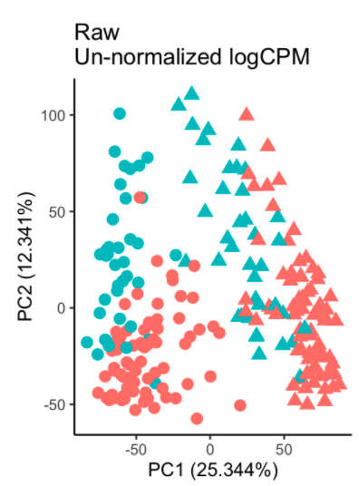
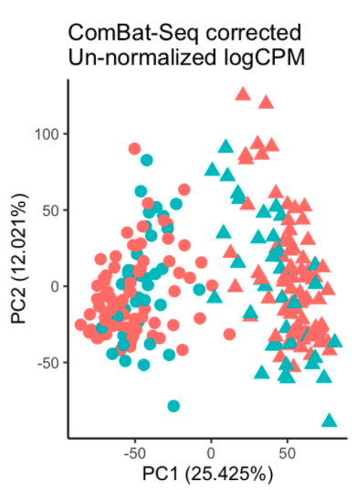

```{r include=FALSE}
knitr::opts_chunk$set(fig.height=2.5) 
```

# Overview

This document covers our recommended data cleaning pipeline for RNA-seq gene count tables. This pipeline includes quality assessment, filtering, and normalization of count tables generated using our [SEAsnake pipeline][seasnake]. The example data are human, bulk, paired-end RNA-seq, but this pipeline can be applied to other organisms or single-read libraries. 

# 0. Setup
## Software

This pipeline should be completed in [R][R] and [RStudio][RStudio]. You should also install the following packages.

```{r eval=FALSE}
#CRAN packages
install.packages(c("tidyverse", "ggrepel", "scales"))

#Bioconductor packages
install.packages("BiocManager")
BiocManager::install(c("edgeR", "limma", "biomaRt", "patchwork"))

#GitHub packages
install.packages("devtools")
devtools::install_github("BIGslu/BIGverse")
devtools::install_github("zhangyuqing/sva-devel")
```

And load them into your current R session.

```{r warning=FALSE}
library(tidyverse)
library(BIGverse)
library(scales)
library(sva)
library(ggrepel)
library(patchwork)
library(limma)
library(edgeR)
#Note we do not load biomaRt because it has conflicts with the tidyverse.
# We instead call its functions with biomaRt::

set.seed(651)
```

## Example data

Example data were obtained from virus-stimulated human plasmacytoid dendritic cells. Actual patient identifiers and metadata have been altered for this tutorial.

>Dill-McFarland KA, Schwartz JT, Zhao H, Shao B, Fulkerson PC, Altman MC, Gill MA. 2022. Eosinophil-mediated suppression and Anti-IL-5 enhancement of plasmacytoid dendritic cell interferon responses in asthma. J Allergy Clin Immunol. Epub ahead of print. doi: [10.1016/j.jaci.2022.03.025](https://doi.org/10.1016/j.jaci.2022.03.025). --- [GitHub](https://github.com/altman-lab/pDC_public)

Specifically, this tutorial uses RNAseq data processed using our [SEAsnake][pipeline1] pipeline. These data are available in `kimma` and names `example.seasnake`.

## Directory structure

Create a directory for the outputs of this tutorial. 

```{r}
dir.create("data_clean", showWarnings = FALSE)
```

# 1. Format data
## 1.1: Alignment metrics

The SEAsnake pipeline outputs library quality metrics from samtools `flagstat` and `picard`. For more details, see [flagstat](http://www.htslib.org/doc/samtools-flagstat.html) and Picard [RnaSeqMetrics](http://broadinstitute.github.io/picard/picard-metric-definitions.html#RnaSeqMetrics). 

Let's load in the metrics files.

```{r}
flagstat <- kimma::example.seasnake$flagstat
picard <- kimma::example.seasnake$picard
```

## 1.2: Sample and library metadata

Next, we read in and combine any patient and/or sample metadata. You may have only one of these data types. In general, patient data include things like age, sex, and any variable that is assigned to each person in the study. In contrast, sample data are variables assigned to each library, like experimental treatment, quality, etc. We combine these along with the above metrics tables to make a single data frame with all metadata.

```{r}
patient <- kimma::example.seasnake$patient %>% 
  mutate(asthma = fct_relevel(factor(asthma), "healthy", after = 0)) 
sample <- kimma::example.seasnake$sample %>% 
  #format any variables that need to be factors
  #Or any other additional formatting that you desire on your data
  mutate(virus = fct_relevel(factor(virus), "none", after = 0)) %>% 
  mutate(batch = factor(batch))

meta <- full_join(sample, patient, by = "ptID") %>% 
  full_join(flagstat, by = "libID") %>% 
  full_join(picard, by = "libID") 
```

This provides the following metrics and metadata for our libraries.

```{r echo=FALSE}
colnames(meta)
```

## 1.3: Counts table

Output by Subread `featureCounts` in SEAsnake, the counts table can be read directly into R.

```{r}
count <- kimma::example.seasnake$fcounts

count[1:3,1:5]
```

# 2. Quality-filter data
## 2.1: Filter poor-quality libraries

We assess sample quality using several metrics from samtools `flagstat` and `picard`. Our standard assessment includes:

* `QC_pass`: total sequences passing quality control (QC), adapter and primer removal with `AdapterRemoval`
    - Named `fastq_total_reads` in BRI processed data
* `paired_mapped`: total QC pass sequences where both read 1 and 2 aligned to the genome. If you had non-paired-end data, you would use `mapped`
* `pct_align`: percent alignment i.e. `paired_mapped`/`QC_pass`
    - Named `mapped_reads_pct` in BRI processed data
* `MEDIAN_CV_COVERAGE`: median coefficent of variation of coverage i.e. how variable sequence coverage is across the genome
    - Named `median_cv_coverage` in BRI processed data

Ideal libraries have high total sequences, high percent alignment, and low CV coverage. Cutoffs for sample removal will vary by data set but our starting recommendations are to remove libraries with: 

* sequences < 1,000,000
* CV coverage > 1
* alignment < 75%

Set your cutoffs here.

```{r}
seq_cutoff <- 1E6
cv_cutoff <- 1
align_cutoff <- 75
```

For the example data, we see that we do not need to remove any libraries due to total sequences.

```{r seqs}
ggplot(meta, aes(x = reorder(libID, QC_pass), y = QC_pass)) +
  geom_col() +
  #Add cutoff line
  geom_hline(yintercept = seq_cutoff) +
  #Log scale y-axis
  scale_y_continuous(trans = 'log10',
    breaks = trans_breaks("log10", function(x) 10^x),
    labels = trans_format("log10", math_format(10^.x))) +
  #Beautify
  theme_classic() +
  labs(x = "Library", y = "Pass-filter sequences (log scale)") +
  theme(axis.text.x = element_text(angle = 45, hjust = 1))
```

However, there are two libraries with median CV coverage near our cutoff. Note that we use `geom_text_repel` to label these libraries.

```{r cv_coverage_labeled}
#Set x-axis max to the larger of 1 or the highest data value
CV_max <- max(1, max(meta$MEDIAN_CV_COVERAGE))

#Set cutoffs to label with libID
cv_cutoff_label <- 0.9
align_cutoff_label <- 75

ggplot(meta, aes(x = MEDIAN_CV_COVERAGE, y = paired_mapped/QC_pass*100)) +
  geom_point() +
  #Rescale axis limits
  lims(x = c(0,CV_max), y=c(0,100)) +
  #Add cutoff lines
  geom_hline(yintercept = align_cutoff, lty="dashed") +
  geom_vline(xintercept = cv_cutoff, lty="dashed") +
  #Label points outside cutoffs
  geom_text_repel(data=filter(meta, MEDIAN_CV_COVERAGE > cv_cutoff_label | 
                              paired_mapped/QC_pass*100 < align_cutoff_label),
            aes(label=libID), show.legend = FALSE, max.overlaps = Inf,
            box.padding = 1) +
  #Beautify
  theme_classic() +
  labs(x = "Median CV coverage", y="Percent alignment")
```

We now filter by our cutoffs. In this case, this leaves the questionable libraries (as we will see why they differ in a later step). 

```{r}
meta.filter <- meta %>% 
  filter(MEDIAN_CV_COVERAGE < cv_cutoff & QC_pass > seq_cutoff &
           paired_mapped/QC_pass*100 > align_cutoff)

count.filter <- count %>% 
  select(1, all_of(meta.filter$libID))
```

This removes `r nrow(meta)-nrow(meta.filter)` libraries. However, you may choose to remove low-quality libraries at this stage.

## 2.2: Filter non-protein-coding genes

Standard differential expression analyses focus on protein-coding genes as these RNA products are the most likely to result in a measurable phenotype. We annotate the counts table genes to their biotypes as well as additional identifiers with `biomaRt`.

For human:

```{r ensembl}
#Get database
ensembl <- biomaRt::useEnsembl(biomart="ensembl", dataset="hsapiens_gene_ensembl",
                                mirror = "uswest")

#Format gene key
key <- biomaRt::getBM(attributes=c("ensembl_gene_id", "entrezgene_id", "hgnc_symbol", 
                                        "gene_biotype", "chromosome_name",
                                        "start_position", "end_position"), mart=ensembl) %>% 
  #Filter protein coding genes
  filter(gene_biotype == "protein_coding")

key.filter <- key %>% 
  #Filter protein coding genes in count table
  filter(ensembl_gene_id %in% count$Geneid) %>% 
  #collapse multiannotations.
  group_by(ensembl_gene_id, hgnc_symbol, gene_biotype, 
           chromosome_name, start_position, end_position) %>% 
  summarise(entrezgene_id = list(unique(entrezgene_id)), .groups = "drop") %>% 
  group_by(ensembl_gene_id, entrezgene_id, gene_biotype, 
           chromosome_name, start_position, end_position) %>% 
  summarise(symbol = list(unique(hgnc_symbol)), .groups = "drop")
```

For mouse (not run here):

```{r ensembl2, eval=FALSE}
#Get database
ensembl <- biomaRt::useEnsembl(biomart="ensembl", dataset="mmusculus_gene_ensembl",
                                mirror = "uswest")

#Format gene key
key <- biomaRt::getBM(attributes=c("ensembl_gene_id", "entrezgene_id", "mgi_symbol", 
                                        "gene_biotype", "chromosome_name",
                                        "start_position", "end_position"), mart=ensembl) %>% 
  #Filter protein coding genes
  filter(gene_biotype == "protein_coding")

key.filter <- key %>% 
  #Filter protein coding genes in count table
  filter(ensembl_gene_id %in% count$Geneid) %>% 
  #collapse multiannotations.
  group_by(ensembl_gene_id, mgi_symbol, gene_biotype, 
           chromosome_name, start_position, end_position) %>% 
  summarise(entrezgene_id = list(unique(entrezgene_id)), .groups = "drop") %>% 
  group_by(ensembl_gene_id, entrezgene_id, gene_biotype, 
           chromosome_name, start_position, end_position) %>% 
  summarise(symbol = list(unique(mgi_symbol)), .groups = "drop")
```

Then, we filter the count table to genes in the protein-coding key.

```{r}
count.filter.pc <- count.filter %>% 
  filter(Geneid %in% key.filter$ensembl_gene_id)
```

This removes `r nrow(count.filter)-nrow(count.filter.pc)` genes from this data set. These data were pre-filtered so you will see A LOT more genes removed in this step in your data. In the current human genome (GRCh38 release 106), there are `r nrow(key)` protein-coding genes, of which `r nrow(count.filter.pc)` were found in this data set.

## 2.3: Correct batch effects {#section2_3}

If your libraries were obtained from multiple experiments and/or sequenced on multiple runs, batch effects may exist in the data. These effects will mask true biological signals and should be corrected prior to modeling. There are a number of ways to batch correct. Our preferred methods are [ComBat-Seq][combat] implemented in `sva` and `limma` `removeBatchEffect`.

First, we look for batch effects in PCA. These effects may be apparent in an overall shift of libraries in a batch.

```{r PCA1a}
BIGpicture::plot_pca(count.filter.pc, meta=meta.filter, 
                     vars="batch", transform_logCPM=TRUE)
```

Or by highlighting libraries sequenced in multiple batches. In your analysis, you will need to change the `unique.ID` variables to those that uniquely identify a sample. For example, these samples can be uniquely identified by patient and virus stimulation.

```{r}
unique.ID <- c("ptID", "virus")

#Identify duplicate libraries
dups <- meta.filter %>% 
  unite("dupID", all_of(unique.ID), remove=FALSE)  %>% 
  count(dupID) %>% 
  filter(n>1)

#Create duplicate ID variable
meta.filter.dups <- meta.filter %>% 
  unite("dupID",unique.ID,remove=FALSE)  %>% 
  mutate(duplicate = ifelse(dupID %in% dups$dupID, dupID, NA))
```

```{r PCA1b}
BIGpicture::plot_pca(count.filter.pc, meta=meta.filter.dups, 
                     vars="duplicate", transform_logCPM=TRUE)
```

Here, we see apparent batch effects where batch A tends to have lower PC2 values than batch B. This is re-enforced by the duplicate samples which group on PC2 more by batch than by duplicate samples.

### 2.3.1 ComBat-Seq {#section2_3_1}

To correct batch effects, we use negative binomial normalization with `sva` ComBat-Seq including 

* `batch`: the variable denoting batches
* `group`: the main effect, in this case virus stimulation
    - If you have more than one main effect, the others can be included as co-variates
* `covar`: co-variates, in this case sex
    - Both `group` and `covar` are variables you want to retain in our later linear models. This ensures that we don't over-correct the data and lose our biological signals of interest.

We also reduce the data set with `shrink = TRUE, gene.subset.n = 2` to run models on 2 random genes. This significantly reduces computational time for this tutorial. *However, a real analysis should be run on a larger subset.* We recommend anywhere from 10,000 to all genes in the data.

```{r combat}
count.filter.pc.combat <- count.filter.pc %>% 
  #Convert count df to matrix
  column_to_rownames("Geneid") %>% 
  as.matrix() %>% 
  #Batch correction
  sva::ComBat_seq(., batch = meta.filter$batch,
                 group = meta.filter$virus,
                 covar_mod = model.matrix(~ sex, meta.filter),
             shrink = TRUE, gene.subset.n = 2) %>% 
  as.data.frame() %>% 
  rownames_to_column("Geneid")
```

Note that the total "co-variates" listed in the above message includes non-reference levels of the main effects (HRV) plus variables listed as `covar` (sex).

This new data set should have reduced batch effects. However, some batch effects likely still exist as this is a difficult correction and we err on the side of less correction to preserve as much of the original data as possible. In this example, we did a rather poor correction based on only 2 genes. So not surprisingly, there is still apparent splitting by batch.

```{r PCA2}
BIGpicture::plot_pca(count.filter.pc.combat, meta=meta.filter.dups, 
                     vars=c("batch","duplicate"), transform_logCPM=TRUE) %>% 
  wrap_plots(ncol=2)
```

In another data set corrected using all genes, we can more readily see a reduction in the batch effects shown by color below.

{width=30%} {width=30%} 

### 2.3.2 limma removeBatchEffect {#limma_batch1}

`limma`'s method for removing batch effects implements linear regression on the normalized counts. Thus, this cannot be completed until after data normalization and log transformation. See [Section 4](#limma_batch2) for details.

#### Choosing a batch correction method

The main difference between our two preferred batch correction methods is implementation on raw (negative binomial) vs normalized (linear) counts. In practice, ComBat-Seq tends to be more conservative and some batch effects remain in the final, normalized counts. In contrast, limma regresses out batch on the final counts so no batch effects remain; this can over-correct the data and remove real biological variation. 

Importantly, both method rely heavily on repeated samples across batches as these technical replicates best represent batch effects. Without repeated samples, neither method performs well.

We recommend comparing both methods. In the end, we generally use ComBat-Seq for small batch effects and limma for large ones.

There are also other batch correction methods you may wish to explore.

* `scBatch` quantile normalization with `QuantNorm( )` implemented on unnormalized counts similar to ComBat-Seq
* Including batch as a variable in linear modeling. You may do this in addition to batch correction or on its own with the uncorrected data

#### Choosing not to correct batch effects

Even if you have measurable batch effects, you may not wish to perform batch correction. This correction directly alters count values and can lead to lose of signal for your actual variables of interest. Some things to consider include:

* How strong are the batch effects? This can be roughly estimated based on the PC to which the batch variable best aligns. In the above data, this is PC2 which explains a substantial percent of variation (17%). Thus, the batch effects are also likely substantial. If the batch PC explains only a small amount of variation, you may wish to skip batch correction as the effects were minimal.
* Does batch correction improve the PCA? After running batch correction, you may not see much improvement in the PCA. Thus, this method did not improve your data and you will likely need to include batch in your models and carefully consider any genes of interest that are also significant for batch.

## 2.4: Filter PCA outliers {#section2_4}

Sometimes one or more libraries will appear as outliers in PCA. We define this as any library more than 3 standard deviations away from the mean on PC1 and/or PC2. 

The two PCA plots show scaled and unscaled values (see `?prcomp` for details). Generally, scaled values are preferred but the unnormalized counts tend to look weird in scaled PCA as they group but sequencing depth and/or quality. Thus, we usually only consider outliers in the unscaled plot.

Here, we have no outliers.

```{r PCA3}
pca3a <- BIGpicture::plot_pca(count.filter.pc.combat, meta=meta.filter, 
                     vars="outlier", transform_logCPM=TRUE,
                     scale = FALSE)
pca3b <- BIGpicture::plot_pca(count.filter.pc.combat, meta=meta.filter, 
                     vars="outlier", transform_logCPM=TRUE,
                     scale = TRUE)

pca3a$outlier + labs(title = "Uncaled PCA") +
  pca3b$outlier + labs(title = "Scaled PCA")
```

You may define outliers at a more or less strict level (`outlier_sd`) or wish to determine them separately within each group of interest (`outlier_group`). For example here, there is one outlier more than 1.5 sd away from the mean within batch but this cutoff is much stricter than we recommend.

```{r PCA4}
BIGpicture::plot_pca(count.filter.pc.combat, meta=meta.filter, 
                     vars="outlier", transform_logCPM=TRUE,
                     outlier_sd = 1.5, outlier_group = "batch")
```

We recommend that you initially remove dramatic outliers but leave those that are borderline or questionable. Then, you can re-assess outliers after gene filtering and normalization. You may find that some are no longer outliers after these steps. If they are, you can return to this step and remove them before repeating subsequent steps. 

If outlier libraries need to be removed, you can use the following code to do so.

```{r}
not.outlier <- pca3a$outlier$data %>% 
  filter(col.group == "no")

meta.filter.out <- meta.filter %>% 
  filter(libID %in% not.outlier$libID)

count.filter.pc.combat.out <- count.filter.pc.combat %>% 
  select(1, all_of(meta.filter.out$libID))
```

If you did not complete ComBat-Seq batch correction, the following code completes the PCA outlier filtering. (Just remove `combat` from the count object names.)

```{r}
not.outlier <- pca3a$outlier$data %>% 
  filter(col.group == "no")

meta.filter.out <- meta.filter %>% 
  filter(libID %in% not.outlier$libID)

count.filter.pc.out <- count.filter.pc %>% 
  select(1, all_of(meta.filter.out$libID))
```

Here, this removes `r nrow(meta.filter)-nrow(meta.filter.out)` libraries because we do not have any at std dev > 3X.

## 2.5: Filter duplicate libraries {#section2_5}

Your data may have have one or more libraries that represent the same sample. This is common when multiple sequencing batches are completed and a couple of samples are re-sequenced to aid in batch effect detection. Unless the majority of samples have multiple libraries (*i.e.* technical replicates), the duplicates should be removed or they will skew downstream analysis.

In addition, if you have duplicate libraries and wish to perform `limma` batch correction, skip this step.

We usually keep the library with the highest number of sequences like so.

```{r}
#Using the name unique ID variables as seen in batch correction
unique.ID

#Find libraries with highest seqs
meta.filter.out.dedup <- meta.filter.out %>% 
  group_by_at(unique.ID) %>% 
  slice_max(order_by = QC_pass)

#Filter lower seq libraries
count.filter.pc.combat.out.dedup <- count.filter.pc.combat.out %>% 
  select(1, all_of(meta.filter.out.dedup$libID))
```

Here, this removes `r nrow(meta.filter.out)-nrow(meta.filter.out.dedup)` libraries, which matches what we expect from the duplicate PCA. Note that these two libraries were the ones with questionable median CV coverage. So we have resolved this quality issue without removing them in step 2.1.

## 2.6: Create DGEList

At this stage, we've completed sample filtering and can collapse our count and meta data into a single list object. This allows us to shorten our long object names as well as works efficiently with the remaining cleaning steps.

First, let's ensure that all the data are in the same order.

```{r}
#Order metadata by library ID
meta.filter.out.dedup.ord <- meta.filter.out.dedup %>% 
  arrange(libID)

#Order counts by library ID and gene ID
count.filter.pc.combat.out.dedup.ord <- count.filter.pc.combat.out.dedup %>% 
  select(1, all_of(meta.filter.out.dedup.ord$libID)) %>% 
  arrange(Geneid)

#Order gene key by gene ID
key.filter.ord <- key.filter %>% 
  arrange(ensembl_gene_id)

#check libraries
identical(meta.filter.out.dedup.ord$libID,
          colnames(count.filter.pc.combat.out.dedup.ord)[-1])

#Check genes
identical(key.filter.ord$ensembl_gene_id,
          count.filter.pc.combat.out.dedup.ord$Geneid)
```

Then, we merge into the DGEList object, `edgeR` format.

```{r}
# Move gene names from a variable in the df to rownames and format to matrix
count.filter.pc.combat.out.dedup.ord.mat <- 
  count.filter.pc.combat.out.dedup.ord %>% 
  column_to_rownames("Geneid") %>% 
  as.matrix()

dat <- DGEList(
  #count table
  counts=count.filter.pc.combat.out.dedup.ord.mat,
  #metadata
  samples=meta.filter.out.dedup.ord,
  #gene info
  genes=key.filter.ord)
```

Or similarly for the version without batch correction or duplicate library removal. We call this other output `dat2`.

```{r}
#Order metadata by library ID
meta.filter.out.ord <- meta.filter.out %>% 
  arrange(libID)

#Order counts by library ID and gene ID
count.filter.pc.out.ord <- count.filter.pc.out %>% 
  select(1, all_of(meta.filter.out.ord$libID)) %>% 
  arrange(Geneid)

#Order gene key by gene ID
key.filter.ord <- key.filter %>% 
  arrange(ensembl_gene_id)

#check libraries
identical(meta.filter.out.ord$libID,
          colnames(count.filter.pc.out.ord)[-1])

#Check genes
identical(key.filter.ord$ensembl_gene_id,
          count.filter.pc.out.ord$Geneid)
```

```{r}
# Move gene names from a variable in the df to rownames and format to matrix
count.filter.pc.out.ord.mat <- 
  count.filter.pc.out.ord %>% 
  column_to_rownames("Geneid") %>% 
  as.matrix()

dat2 <- DGEList(
  #count table
  counts=count.filter.pc.out.ord.mat,
  #metadata
  samples=meta.filter.out.ord,
  #gene info
  genes=key.filter.ord)
```

## 2.7: Filter low abundance genes

Low abundance (small counts) and rare genes (many 0 counts) are removed from the data because they:

* are unlikely to be significantly differentially expressed
* greatly inflate multiple comparison correction 
* often do not meet linear modeling assumptions regarding mean variance trends (*e.g.* because of small N, they show lower variance than what is expected for their mean expression)

Our goal is to remove genes in the lower left of the mean-variance plot because counts (x) and variance (y) are low *e.g.* these genes break the red mean variance trend.

```{r fig.width=4}
BIGpicture::plot_mv(dat, design = "~ virus")
```

We use our custom function to retain only genes that are at least `min.CPM` counts per million in at least `min.sample` number of samples OR in at least `min.pct` percent of samples. Here, we use 0.1 CPM in at least 3 samples. 

```{r}
dat.abund <- RNAetc::filter_rare(dat, min.CPM = 0.1, min.sample = 3,
                                 gene.var="ensembl_gene_id")

dat2.abund <- RNAetc::filter_rare(dat2, min.CPM = 0.1, min.sample = 3,
                                 gene.var="ensembl_gene_id")
```

This yields slightly different results for the two versions of the data. We visualize just `dat` here.

Plotting the filtered data, we see the red trend line no longer curves down on the left. There is still a bit of the downward tail of dots but this filtering is sufficient.

```{r fig.width=4}
plot_mv(dat.abund, design = "~ virus")
```

```{r echo=FALSE}
#Count genes removed
genes <- nrow(dat$genes)
genes.abund <- nrow(dat.abund$genes)
```

There is no exact cutoff for this filtering, and you should try several cutoffs to observe the effects. In general, we use minimum CPM from 0.1 - 1, minimum samples around 3 for small data sets, or minimum samples from 5 - 10% in larger data sets. It is important to keep the minimum sample cutoff larger than your smallest group of interest, otherwise you may filter genes specifically associated with one group. For example, if you have 10 libraries with 5 each of media vs stimulated, you're `min.sample` value should not be > 5 or else you will remove genes only expressed in one of media or stimulated groups.

This filtering generally results in the removal of around 25% of genes. Here, our filtering is on the stricter side (which is common in small data sets), removing `r genes-genes.abund` or `r round((genes-genes.abund)/genes*100, digits=0)`% of genes. 

You may also wish to look for specific genes of interest and ensure they are not being filtered. This following calculates some statistics on filtered genes and saves a `csv` for your perusal.

```{r}
rare <- as.data.frame(cpm(dat$counts)) %>% 
  #Filter genes removed
  rownames_to_column("ensembl_gene_id") %>% 
  filter(!(ensembl_gene_id %in% rownames(dat.abund$counts))) %>% 
  #Add gene symbols
  left_join(dat$genes, by = "ensembl_gene_id") %>% 
  #format
  select(-c(chromosome_name:end_position)) %>%
  pivot_longer(-c(ensembl_gene_id, gene_biotype, symbol, entrezgene_id)) %>% 
  group_by(ensembl_gene_id, gene_biotype, symbol) %>% 
  summarise(mean.CPM = mean(value, na.rm=TRUE),
            min.CPM = min(value, na.rm=TRUE),
            max.CPM = max(value, na.rm=TRUE),
            express.in.libs = length(value[value > 0]),
            .groups="drop")

write_csv(rare, file="data_clean/rare_genes.csv")
rare
```

# 3. Normalize data
## 3.1: Trimmed mean of M (TMM)

RNA-seq counts are not independent within a library and not comparable across libraries. A library with 1 million sequences will have higher counts for most genes than one with 1 thousand sequences. We correct for this aspect of the data with the following normalization steps.

TMM defines a reference sample from your data set as the one with the most representative expression for the overall data set. Specifically, the reference sample is the one whose upper quartile is closest to the overall data set upper quartile. The upper quantile is the value (`x`) where 75% of genes have expression < `x`. Thus, the reference sample is the sample whose `x` is the closest to mean(`x`) across all samples.

All other samples are considered test samples. For each test sample, a scaling factor is calculated based on the weighted mean of log ratios of representative genes between the test and reference. These representative genes are a subset of the data set, removing the highest and lowest expressed genes as well as genes with the highest and lowest log ratios. The exact genes used as representative genes for scaling are dynamic and specific to each test sample.

The calculated scaling factors are then applied to the counts table automatically in the `voom` step.

```{r tmm}
dat.abund.norm <- calcNormFactors(dat.abund, method = "TMM")
dat2.abund.norm <- calcNormFactors(dat2.abund, method = "TMM")
```

## 3.2: voom aka log2 counts per million (CPM)

We continue normalization by converting counts to CPM within each sample, thus accounting for differential sampling depth. We also perform log2 transformation, because RNA-seq data are heavily right-skewed and thus, violate assumptions of normality.

```{r warning=FALSE}
as.data.frame(dat.abund$counts) %>% 
  rownames_to_column() %>% 
  pivot_longer(-rowname) %>% 
ggplot() +
  geom_histogram(aes(x=value), bins = 100) +
  theme_classic() +
  labs(x = "count", y = "occurences") +
  lims(x=c(0,1000))
```

`voom` performs both of these steps! We use `voomWithQualityWeights` to additionally calculate sample specific quality weights that can be of use as co-variates in linear modeling.

```{r voom, fig.height=3.5}
dat.abund.norm.voom <- voomWithQualityWeights(
                           dat.abund.norm,
                           design=model.matrix(~ virus, 
                                               data=dat.abund.norm$samples),
                           plot=TRUE)

dat2.abund.norm.voom <- voomWithQualityWeights(
                           dat2.abund.norm,
                           design=model.matrix(~ virus,
                                               data=dat2.abund.norm$samples),
                           plot=TRUE)
```

# 4. limma removeBatchEffect {#limma_batch2}
## 4.1: Correct batch effects

Now, we return to batch correction. You should only complete this section on data that *were not* batch corrected by ComBat-Seq ([Section 2.3.1](#section2_3_1)) and *did not* have duplicates removed ([Section 2.5](#section2_5)). In this tutorial, this is `dat2.abund.norm.voom`.

With your uncorrected voom object, regress out batch effects with a linear model in `removeBatchEffect` including

* `batch`: the variable denoting batches
* `covar`: additional numeric co-variates to correct for (*not used here*)
    - You can use this function to correct for variables other than batch
* `design`: model matrix with the main effects and co-variates you want to retain signal for. , in this case sex
    - These are variables you want to retain in our later linear models. This ensures that we don't over-correct the data and lose our biological signals of interest.
    - Comparable to ComBat-Seq's `group` + `covar` variables

```{r}
voom.removeBatch <- removeBatchEffect(
  dat2.abund.norm.voom,
  batch = dat2.abund.norm.voom$targets$batch,
  design = model.matrix(~ virus + sex, data = dat2.abund.norm.voom$targets)
)
```

Incorporate the batched corrected counts into a new voom object.

```{r}
dat2.abund.norm.voom.removeBatch <- dat2.abund.norm.voom
dat2.abund.norm.voom.removeBatch$E <- voom.removeBatch
```

Visualize before and after batch correction. We see the batch effect is completely removed on PC2, though the duplicates still don't look great. A larger data set generally performs better.

```{r}
BIGpicture::plot_pca(dat2.abund.norm.voom$E, meta = meta.filter.dups,
                     vars=c("batch","duplicate")) %>% 
  wrap_plots(ncol=2)

BIGpicture::plot_pca(dat2.abund.norm.voom.removeBatch$E, meta = meta.filter.dups,
                     vars=c("batch","duplicate")) %>% 
  wrap_plots(ncol=2)
```

## 4.2: Filter duplicate libraries

Because this version skipped [Section 2.5](#section2_5), we now remove duplicate samples.

```{r}
#Using the name unique ID variables as seen in batch correction
unique.ID

dat2.abund.norm.voom.removeBatch.dedup <- dat2.abund.norm.voom.removeBatch

#Find libraries with highest seqs
dat2.abund.norm.voom.removeBatch.dedup$targets <-
  dat2.abund.norm.voom.removeBatch.dedup$targets %>% 
  group_by_at(unique.ID) %>% 
  slice_max(order_by = QC_pass)

#Filter lower seq libraries
dat2.abund.norm.voom.removeBatch.dedup$E <- 
  as.data.frame(dat2.abund.norm.voom.removeBatch.dedup$E) %>% 
  select(all_of(dat2.abund.norm.voom.removeBatch.dedup$targets$libID)) %>% 
  as.matrix()
```

# 5. Summary and save
#### Filtering

The following summarizes libraries removed from analysis. In this tutorial, all libraries pass-filter and move on to analysis.

```{r echo=FALSE}
meta %>% 
  #ID filters
  mutate(
    CV.filter = ifelse(MEDIAN_CV_COVERAGE > cv_cutoff, 
                             "high CV coverage", NA),
    dup.filter = ifelse(paired_mapped/QC_pass*100 < align_cutoff, 
                            "low align %", NA),
    seq.filter = ifelse(QC_pass < seq_cutoff, 
                              "low total seqs", NA),
    pca.filter = ifelse(libID %in% meta.filter$libID &
                        !(libID %in% meta.filter.dups$libID),
                        "PCA outlier", NA),
    dupSamp.filter = ifelse(libID %in% meta.filter.out$libID &
                        !(libID %in% meta.filter.out.dedup$libID),
                        "duplicate sample", NA)) %>% 
  #Combine filter tags
  mutate(filter = paste(CV.filter, dup.filter, seq.filter,
                        pca.filter, dupSamp.filter, sep=", ")) %>% 
  mutate(filter = gsub("NA, ","",filter)) %>% 
  mutate(filter = gsub(", NA","",filter)) %>% 
  mutate(filter = gsub("NA","",filter)) %>% 
  #Add pass filter label
  mutate(filter = ifelse(filter=="","pass-filter",filter)) %>% 
  select(libID, filter)
```

#### Re-check PCA outliers

Re-assess PCA outliers. Some new samples may pop up after normalization but unless they are very clearly outliers, you should leave them in the data set. Also note that the unscaled and scaled PCA look much more similar after normalization. This is expected and we will use the scaled PCA in all future analyses.

You can also use this section to check if outliers identified in [Section 2.4](#section2_4) remain outliers when you leave them in the data at that stage. Simply return to that section and comment out `filter(col.group == "no")` then run all subsequent steps.

```{r PCA5}
pca5a <- BIGpicture::plot_pca(dat.abund.norm.voom, 
                     vars="outlier",
                     scale = FALSE)
pca5b <- BIGpicture::plot_pca(dat.abund.norm.voom, 
                     vars="outlier",
                     scale = FALSE)

pca5a$outlier + labs(title = "Uncaled PCA") + 
  pca5b$outlier + labs(title = "Scaled PCA")
```

#### Save

Write as `RData`

```{r}
save(dat.abund.norm, file = "data_clean/dat_combat.RData")
save(dat.abund.norm.voom, file = "data_clean/voom_combat.RData")
```

Write counts as `csv`

```{r}
as.data.frame(dat.abund.norm$counts) %>% 
  rownames_to_column("ensembl_gene_id") %>% 
  write_csv("data_clean/counts_combat.csv")

as.data.frame(dat.abund.norm.voom$E) %>% 
  rownames_to_column("ensembl_gene_id") %>% 
  write_csv("data_clean/counts_voom_combat.csv")
```

And similarly for the limma batch corrected data. We rename the object so either version can be used in downstream tutorials.

```{r}
dat.abund.norm <- dat2.abund.norm
dat.abund.norm.voom <- dat2.abund.norm.voom.removeBatch.dedup
```

Write as `RData`

```{r}
save(dat.abund.norm, file = "data_clean/dat_limma.RData")
save(dat.abund.norm.voom, file = "data_clean/voom_limma.RData")
```

Write counts as `csv`

```{r}
as.data.frame(dat.abund.norm$counts) %>% 
  rownames_to_column("ensembl_gene_id") %>% 
  write_csv("data_clean/counts_limma.csv")

as.data.frame(dat.abund.norm.voom$E) %>% 
  rownames_to_column("ensembl_gene_id") %>% 
  write_csv("data_clean/counts_voom_limma.csv")
```

# R session

```{r}
sessionInfo()
```

# *Navigation*

* Previous tutorial: [fastq to counts][pipeline1]
* Next tutorial: [voom to DEG][pipeline3]
* [Index][index]

***

[R]: https://cran.r-project.org/
[RStudio]: https://www.rstudio.com/products/rstudio/download/
[seasnake]: https://bigslu.github.io/SEAsnake/vignette/SEAsnake_vignette.html
[kimma]: https://bigslu.github.io/kimma_vignette/kimma_vignette.html
[combat]: https://doi.org/10.1093/nargab/lqaa078
[pipeline1]: https://bigslu.github.io/tutorials/RNAseq/1.RNAseq_fastq.to.counts.html
[pipeline2]: https://bigslu.github.io/tutorials/RNAseq/2.RNAseq_counts.to.voom.html
[pipeline3]: https://bigslu.github.io/tutorials/RNAseq/3.RNAseq_voom.to.DEG.html
[pipeline4]: https://bigslu.github.io/tutorials/RNAseq/4.RNAseq_modules.html
[index]: https://bigslu.github.io/tutorials/
